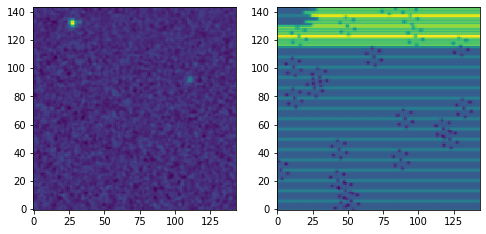
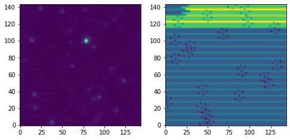

# ALFALFA Demo

Demo of the [ALFALFA
survey](http://egg.astro.cornell.edu/alfalfa/index.php), data cubes, and
Jupyter notebooks

# ALFALFA Data Cubes

## Creating the Data Cubes

Using a bit of Python code ([view
here](https://github.com/brkent/alfalfademo2025/blob/main/processcube_dualpol.py)),
we can read the IDL structure into a NumPy record array and then use
AstroPy to create the set of four FITS files. The data cube (144 x 144 x
1024 x 2) metadata, and continuum metadata (144 x 144 x 2) is in each
primary FITS header. The spectral data cubes, spectralweights, continuum
map, and continuum weights all comprise a set of images.

A set of ALFALFA FITS files (spectral, spectral weights, continuum, and
continuum weights) can be found
[here](https://www.cv.nrao.edu/~bkent/astro/alfalfa).

The brief tutorial below can be downloaded as a [Jupyter
notebook](https://github.com/brkent/alfalfademo2025/blob/main/ALFALFA.ipynb).

## Metadata information

We can access the ALFALFA data cube via the following code. This is NOT
exhaustive - you could use AplPy to have the coordinates shown, etc. All
we are doing here is accessing the data\... :

    from astropy.io import fits
    spectralfitsfile = '1220+09a_spectral.fits'
    spectralweightsfitsfile = '1220+09a_spectralweights.fits'
    continuumfitsfile = '1220+09a_continuum.fits'
    continuumweightsfitsfile = '1220+09a_continuumweights.fits'
    fits.info(spectralfitsfile)

This gives us: :

    #------------------------------------------------------------------------------
    #No.    Name             Ver    Type      Cards   Dimensions            Format
    #  0  PRIMARY              1 PrimaryHDU     102   (144, 144, 1024, 2)   float32   

## Data and Header information

We can get the cube, cube weights, continuum map, continuum weights, and
associated headers: :

    from astropy.io.fits import getdata
    datacube, spectral_hdr = getdata(spectralfitsfile, 0, header=True)
    weights, weights_hdr = getdata(spectralweightsfitsfile, 0, header=True)
    cont, continuum_hdr = getdata(continuumfitsfile, 0, header=True)
    contweights, contweights_hdr = getdata(continuumweightsfitsfile, 0, header=True)

## Channel Map

Show a particular channel and polarization with matplotlib, along with
the weighting map: :

    from matplotlib import pyplot as plt
    fig = plt.figure(figsize=(8,8))
    ax1 = fig.add_subplot(1, 2, 1)
    ax1.imshow(datacube[0,406,:,:], origin='lower')

    ax2 = fig.add_subplot(1, 2, 2)
    ax2.imshow(weights[0,406,:,:], origin='lower')
    plt.show()

## Continuum Map

Show a polarization averaged continuum map: :

    import numpy as np

    fig = plt.figure(figsize=(8,8))
    ax1 = fig.add_subplot(1,2,1)
    ax1.imshow((cont[0,:,:]+cont[1,:,:])/2.0, origin='lower')

    ax2 = fig.add_subplot(1, 2, 2)
    ax2.imshow((contweights[0,:,:]+contweights[1,:,:])/2.0, origin='lower')
    plt.show()

## Spectrum

Show a spectrum and weights: :

    fig, axs = plt.subplots(2)
    fig.suptitle('HI Spectrum and weights')

    avgcube=np.mean(datacube, axis=0)
    avgcube.shape
    spectrum = np.sum(avgcube[:,128:137,24:34], axis=(1,2))

    avgweights = np.mean(weights, axis=0)
    weightsspectrum = np.mean(avgweights[:,128:137,24:34], axis=(1,2))

    axs[0].plot(spectrum)
    axs[0].set_ylim([-200,3000])
    axs[1].plot(weightsspectrum, color='red')

    plt.show()

